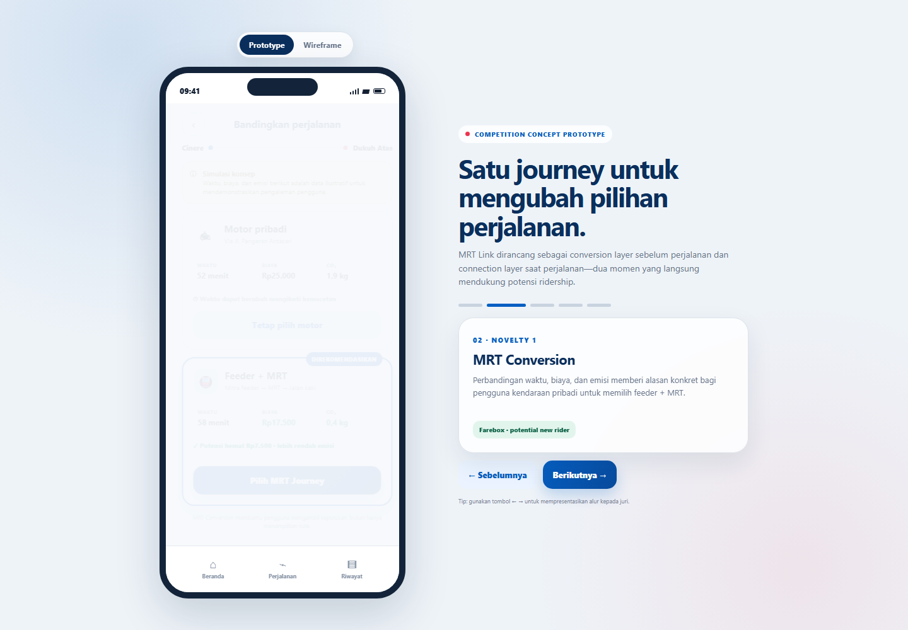

# MRT Link

**First/Last-Mile Partner Platform — proposal concept and interactive prototype**

MRT Link adalah konsep modul perjalanan multimoda dalam ekosistem MyMRTJ. Solusi ini membantu calon pengguna membandingkan kendaraan pribadi dengan feeder + MRT melalui **MRT Conversion**, kemudian menjaga koneksi perjalanan melalui **Connection Assist**.

## Demo

- [Buka prototype interaktif](outputs/mrt-link-prototype.html)
- [Baca proposal strengthening pack](outputs/mrt-link-proposal-pack.md)
- [Petunjuk dan isi paket](outputs/README.md)

Jika GitHub Pages diaktifkan dari root branch, `index.html` akan mengarahkan pengunjung ke prototype.

## Alur utama

1. Input perjalanan door-to-door.
2. Bandingkan kendaraan pribadi dengan feeder + MRT.
3. Pilih satu integrated journey.
4. Gunakan Connection Assist ketika koneksi berisiko terlewat.
5. Tinjau Journey Record dan dampak perjalanan.

## Catatan

Seluruh waktu, biaya, kendaraan, dan emisi dalam prototype merupakan data simulasi untuk demonstrasi pengalaman pengguna, bukan klaim operasional.

